# x86 用户态中断 (uintr) (WIP)

Intel 在 2021 年 5 月发布的 Intel 指令集架构拓展中加入了 x86 平台上的用户态中断规范，
在 2022 H1 发布的 Sapphire Rapids 系列处理器中提供了硬件实现。在硬件架构上，
中断接收方是用户空间的任务，而发送方可以是另一个用户任务、内核或外部设备。目前 Intel
的团队在 Linux 内核中实现了用户态任务之间的中断机制。

## 概述

用户态中断被定义为架构中的新事件，可以在 CPL=3 的 64 位模式下传递给软件进行处理，而不需要改变段状态。
不同的用户中断通过一个 6 位的用户中断向量区分，在传递中断时被压到栈上。新增的 UIRET（用户中断返回）
指令用于退出中断处理上下文。

用户中断架构由新的内核管理的状态进行配置，这个状态包括新的 MSR ，在内核切换线程时进行更新。

其中一个 MSR 指向名为**用户发布中断描述符 (User Posted Interrupt Descriptor, UPID)** 的数据结构，
用户态中断可以发布到与某个线程关联的 UPID 中。在接收到一个普通中断后，处理器将根据 UPID
中的内容将其识别为用户态中断并传递给软件，这一过程名为**用户中断通知**。

系统软件可以定义用于发布用户中断和发送用户中断通知的操作。用户中断架构定义了一条新指令 `SENDUIPI` ，
应用软件可以使用这条指令发送处理器间用户中断（用户态 IPI ）。执行 `SENDUIPI` 指令时，
处理器会根据**用户中断目标表 (User Interrupt Target Table, UITT)** 的内容，
在相应 UPID 中发布一个用户中断，并发送一个用户中断通知。

## 用户态中断状态

| 状态名        | 全称                      | 描述                                    |
| ------------- | ------------------------- | --------------------------------------- |
| UIRR          | Uintr Request Register    | 某位为 1 表示对应下标的用户态中断待处理 |
| UIF           | Uintr Flag                | 用户态中断使能                          |
| UIHANDLER     | Uintr Handler             | 中断处理函数入口地址                    |
| UISTACKADJUST | Uintr Stack Adjustment    | 中断处理栈的基址或偏移量                |
| UINV          | Uintr Notification Vector | 识别为用户态中断处理的中断编号          |
| UPIDADDR      | UPID Address              | UPID 的地址                             |
| UITTADDR      | UITT Address              | UITT 的地址，用于 `SENDUIPI`            |
| UITTSZ        | UITT Size                 | UITT 的大小                             |

以下新增的 MSR 用于保存用户态中断的状态：

| MSR                    | 地址 | 状态内容      |
| ---------------------- | ---- | ------------- |
| IA32_UINTR_RR          | 985H | UIRR          |
| IA32_UINTR_HANDLER     | 986H | UIHANDLER     |
| IA32_UINTR_STACKADJUST | 987H | UISTACKADJUST |
| IA32_UINTR_MISC        | 988H | UITTSZ, UINV  |
| IA32_UINTR_PD          | 989H | UPIDADDR      |
| IA32_UINTR_TT          | 98AH | UITTADDR      |

## 中断传递和处理

处理流程图如下：

## 中断通知

## 发送用户态跨核中断

## 内核数据结构

