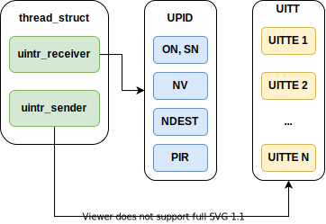

# x86 用户态中断 (uintr) (WIP)

Intel 在 2021 年 5 月发布的 Intel 指令集架构拓展中加入了 x86 平台上的用户态中断规范，
在 2022 H1 发布的 Sapphire Rapids 系列处理器中提供了硬件实现。在硬件架构上，
中断接收方是用户空间的任务，而发送方可以是另一个用户任务、内核或外部设备。目前 Intel
的团队在 Linux 内核中实现了用户态任务之间的中断机制。

## 概述

用户态中断被定义为架构中的新事件，可以在 CPL=3 的 64 位模式下传递给软件进行处理，而不需要改变段状态。
不同的用户中断通过一个 6 位的用户中断向量区分，在传递中断时被压到栈上。新增的 UIRET（用户中断返回）
指令用于退出中断处理上下文。

用户中断架构由新的内核管理的状态进行配置，这个状态包括新的 MSR ，在内核切换线程时进行更新。

其中一个 MSR 指向名为**用户态中断发布描述符 (User Posted Interrupt Descriptor, UPID)** 的数据结构，
用户态中断可以发布到与某个线程关联的 UPID 中。在接收到一个普通中断后，处理器将根据 UPID
中的内容将其识别为用户态中断并传递给软件，这一过程名为**用户中断通知**。

系统软件可以定义用于发布用户中断和发送用户中断通知的操作。用户中断架构定义了一条新指令 `SENDUIPI` ，
应用软件可以使用这条指令发送处理器间用户中断（用户态 IPI ）。执行 `SENDUIPI` 指令时，
处理器会根据**用户中断目标表 (User Interrupt Target Table, UITT)** 的内容，
在相应 UPID 中发布一个用户中断，并发送一个用户中断通知。

## 用户态中断状态

| 状态名        | 全称                      | 描述                                    |
| ------------- | ------------------------- | --------------------------------------- |
| UIRR          | Uintr Request Register    | 某位为 1 表示对应下标的用户态中断待处理 |
| UIF           | Uintr Flag                | 用户态中断使能                          |
| UIHANDLER     | Uintr Handler             | 中断处理函数入口地址                    |
| UISTACKADJUST | Uintr Stack Adjustment    | 中断处理栈的基址或偏移量                |
| UINV          | Uintr Notification Vector | 识别为用户态中断处理的中断编号          |
| UPIDADDR      | UPID Address              | UPID 的地址                             |
| UITTADDR      | UITT Address              | UITT 的地址，用于 `SENDUIPI`            |
| UITTSZ        | UITT Size                 | UITT 的大小                             |

以下新增的 MSR 用于保存用户态中断的状态：

| MSR                    | 地址 | 状态内容      |
| ---------------------- | ---- | ------------- |
| IA32_UINTR_RR          | 985H | UIRR          |
| IA32_UINTR_HANDLER     | 986H | UIHANDLER     |
| IA32_UINTR_STACKADJUST | 987H | UISTACKADJUST |
| IA32_UINTR_MISC        | 988H | UITTSZ, UINV  |
| IA32_UINTR_PD          | 989H | UPIDADDR      |
| IA32_UINTR_TT          | 98AH | UITTADDR      |

## Uintr 传递和处理

当 `UIRR != 0` 时即表示有未处理的用户态中断，任何更新 UIRR 的行为都会触发处理器的用户态中断识别流程，
如直接写入 `IA32_UINTR_RR` 寄存器、Uintr 传递、通知、VMX 转换等。如果 `CR4.UINTR == 1`
且处理器识别到了未处理的用户态中断，在满足下列条件时，处理器就会将中断传递到指令边界上：

1. `UIF == 1`
2. 没有阻塞中的 `MOC SS` 或 `POP SS` 操作
3. `CPL == 3`
4. `IA32_EFER.LMA == CS.L == 1` ，即处理器处于 64 位模式
5. 软件没有运行在 Enclave 中

用户态中断的优先级仅低于普通中断，它会将处理器从 `TPAUSE` 和 `UMWAIT` 指令的状态中唤醒，
但不会唤醒处于关闭或等待 SIPI 状态的处理器。用户态中断不会改变 CPL ，其传递流程图如下：

如果 `UISTACKADJUST[0] == 0` ，中断传递流程会将 `RSP` 减去 `UISTACKADJUST` ，否则会将
`RSP` 替换为 `UISTACKADJUST` 。传递流程总是将 `RSP` 对齐到 16 字节边界。

Uintr 的传递会使进行中的事务操作放弃，并返回到非事务操作的执行环境。事务放弃会加载 `EAX` ，
如同被普通中断打断一样。Uintr 在事务放弃处理完之后传递。

Uintr 传递对栈的访问可能触发异常，这些异常处理之前 `RSP` 会恢复到之前的值，如果这些异常产生了一个使用 EXT
位的错误码，该位会被清除。产生这种异常时， UIRR 不会更新， UIF 不会清除，在异常处理完成之后，
处理器会继续识别和传递先前的 Uintr。

如果控制流强化 (control-flow enforcement technology, CET) 的影子栈功能在 `CPL == 3` 时被启用，
Uintr 传递会将返回指令的指针推入影子栈中。如果间接分支追踪特性被启用， Uintr
传递会将间接分支追踪器转移到 `WAIT_FOR_ENDBRANCH` 状态； Uintr 处理函数的第一条指令应当是 `ENDBR64` 。

## Uintr 通知

**用户态中断发布**是平台主体或 CPU 上运行的软件将用户态中断记录到内存中的**用户态中断发布描述符** (UPID)
的过程。平台主体或软件可以向中断目标正在运行的逻辑处理器发送一个普通中断，该中断称作**用户态中断通知**。

UPID 的结构定义如下：

| 位      | 名称           | 描述                                                                                                                      |
| ------- | -------------- | ------------------------------------------------------------------------------------------------------------------------- |
| 0       | 待处理通知     | 若该位被置位表示 PIR 中有一个或多个待处理的 Uintr 通知                                                                    |
| 1       | 抑制通知       | 该位被置位，平台主体向此描述符发布中断时不应发送通知                                                                      |
| 15:2    | 预留           | 通知过程会忽略这些位， `SENDUIPI` 要求这些位为 0                                                                          |
| 23:16   | 通知向量       | 由 `SENDUIPI` 使用                                                                                                        |
| 31:24   | 预留           | 通知过程会忽略这些位， `SENDUIPI` 要求这些位为 0                                                                          |
| 63:32   | 通知目标       | 目标的物理 APIC ID，由 `SENDUIPI` 使用。在 xAPIC 模式下，第 47:40 位为 8 位 APIC ID；在 x2APIC 模式，该域为 32 位 APIC ID |
| 127：64 | 发布的中断请求 | 每一个中断向量对应一位，如果该位为 1 表示有相应编号的用户态中断请求                                                       |

## 发送用户态跨核中断

## 内核数据结构

