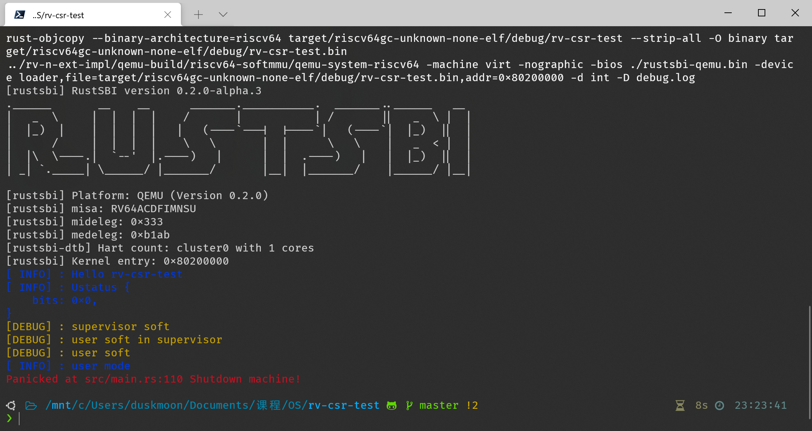

# 硬件与模拟器

> 本节介绍硬件与模拟器中实现的主要特性
>
> 可以在 [N 扩展规范草案](ch1_n_ext_spec.md) 一节看到完整的 N 扩展及相关寄存器描述。在 [用户态中断的使用](ch1_use_of_user_mode_trap.md) 一节中看到关于用户态中断使用的描述。

## QEMU with extension N

出于稳定性考虑，我们选择以 [QEMU 的 5.0 稳定分支](https://github.com/qemu/qemu/tree/stable-5.0) 为基础，添加用户态中断所需的寄存器和相应的中断处理函数。

- 添加寄存器 `ustatus` `uip` `uie` `sideleg` `sedeleg` `uepc` `utvec` `ucause` `utval` `uscratch`
- 添加用户态中断的触发部分：符合条件时使上述处理器进入中断状态
- 实现 `uret` 指令

一个使用修改后的 QEMU 进行的用户态中断的简单测试结果：

图中的 `user soft` 为用户态的中断处理程序接收到 `user soft interrupt` 后输出的信息，`user mode` 为用户态程序输出的信息。

## Labeled RISC-V CPU

### 设计目标

本设计将 uCore-SMP 系统适配到标签化 RISC-V 架构的 FPGA 版本上，并基于二者在内核中实现调度进程所使用的 LLC 和内存带宽资源的功能，提供相应的接口和演示程序，对资源调度的效果进行展示。

### 设计方案

#### 硬件

设计使用标签化 RISC-V 架构的 FPGA 版本和赛灵思公司的 ZCU102 开发板，搭载一颗 Zynq® UltraScale+™ XCZU9EG-2FFVB1156E MPSoC 。该芯片的处理系统（PS）部分具有四个 Arm A53 核心，运行 Linux 系统，主要功能为烧写 FPGA 比特流，辅助其复位和启动，并转发串口数据。可编程逻辑（PL）部分实现为四个 Rocket Core，ISA 为 RV64IMAC，时钟频率 100MHz，具有 2MB 共享 L2 缓存和 2GB DRAM 。

标签化 RISC-V 架构在每个核心上添加了一个 CSR 记录当前核心上正在运行的程序的标签，并使用该标签标记程序的资源请求。该寄存器编号为 0x9C0 ，访问权限为 S 态可读写。标签控制平面以 MMIO 形式映射到 0x20000 地址，可以向其中写入标签的缓存和内存控制参数，并读取标签对应的 L1 到 L2 的流量。

L2 缓存被划分为 16 块，使用位掩码对标签对应进程可用的缓存区域进行控制，若某位为 1 ，则表示该进程可以使用该块缓存；反之则不能。若某块缓存在多个标签的掩码中均为 1 ，则该块缓存由这些标签对应的进程共享。

内存带宽使用令牌桶算法进行控制。每个标签有一个令牌桶，控制器每隔 `freq` 个时钟周期会向桶中放入 `inc` 个令牌，桶的容量为 `size` ，当令牌数量达到桶容量时，令牌数量不再增加。一个令牌对应 64 比特的数据量，进程每次发起一次内存读写请求，会消耗标签令牌桶中相应数据量的令牌，当桶中没有令牌时，请求会被挂起。当进程持续访问内存时，其最大内存带宽近似为 \\(inc\cdot{clock\over freq}\cdot 64 \,\mathrm{bps}\\) 。

#### 固件：lrv-rust-bl

该部分基于 RustSBI 的 QEMU 参考实现进行开发，使用 Rust 语言编写。PL 所用串口外设为 UART Lite，与 QEMU 中所用的 NS16550A 不同，需要重新实现其初始化和收发代码。

该 RISC-V 核心不支持非对齐 load/store 指令，此类指令会触发相应的非对齐异常，但同时内核和应用程序中又无法完全避免这些指令，为了实现二者的兼容，固件在相应的异常处理例程中解码触发异常的指令，根据其选择的寄存器和非对齐地址偏移量，使用两次对齐的 load/store 进行模拟。需要注意的是，该平台同时支持压缩指令（C）扩展，因而指令长度可能为 2 或 4 字节，指令本身可能处于非对齐地址上，且 load 和 store 各有三种（常规指令、基于通用寄存器中地址的压缩指令、基于栈指针寄存器中地址的压缩指令），指令格式不尽相同，解码过程较为繁琐。

该启动器代码仓库位于 https://github.com/Gallium70/lrv-rust-bl ，对该启动器更详细的介绍见代码仓库中相应的文档。
