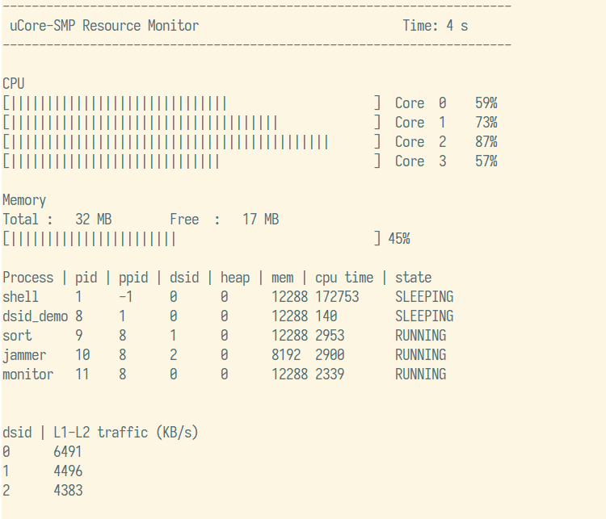

# 应用程序

为了使用标签系统，测量和展示标签系统的控制效果，设计了以下几个用户态应用程序：sort、jammer、prime、monitor、dsid_demo。

## sort

对 501202 个 32 位无符号整数，使用基数排序法进行排序，基为 65536 ，数据使用随机数生成器和固定的种子生成，并使用 sharedmem 作为动态申请内存的方式。每个进程会将自己的 pid 加入共享内存名字中，以确保多个负载不会申请到同一块共享内存。程序将自身的运行时间作为返回值，单位是毫秒。

这是一个内存密集型负载，消耗约 4.5MB 内存空间和 8MB/s 的内存带宽。

## prime

计算 2 到 52021 之间质数的个数。使用朴素算法，对于每个数 x ，枚举 2 到 x/2 之间的数，判断是否能够整除 x，若能，则 x 不是质数。这是一个计算密集型负载，可以用于验证多核正常运行，且运行时间几乎不受内存带宽限制的影响。

## jammer

这是一个干扰负载，在一个有 524288 个 32 位无符号整数的数组上随机进行读写，消耗内存带宽。申请内存的方式与 sort 程序相同，消耗约 2MB 内存空间和 8MB/s 的内存带宽。

## monitor

一个监测系统资源使用状况的程序，监测的资源包括 CPU 使用率、可用内存空间、各进程的运行时间、状态和内存占用、各标签的 L1 和 L2 之间的流量。每隔一秒输出一次，运行十秒后退出。其中 CPU 、内存和进程使用设备文件抽象接口，标签流量使用 `get_l2_traffic` 系统调用。运行界面如下：

## dsid_demo

本程序中内置了若干组令牌桶和缓存掩码参数用于分配给指定的负载，并执行 `monitor` 程序监测系统资源的使用情况。

使用方法为 `dsid_demo app1 param1 [app2 param2 [app3 param3]]` ，最多同时启动 3 个负载。例如， `dsid_demo sort 2 prime 1` 将为 `sort` 进程分配 2 号参数组，为 `prime` 进程分配 1 号参数组。由于可用的标签数量有限，同时为了方便监测起见，标签并不与参数组一一对应，而是为每个负载分配不同的标签，`appX` 的标签编号即为 X 。在上例中， `sort` 进程标签为 1 ，而 `prime` 进程标签为 2 。

各组参数具体的设计，是为了实现以下四种测试场景：

- 不调控
- 内存带宽 5M：5M，缓存 768K：768K
- 内存带宽 7M：2M，缓存 1280K：256K
- 内存带宽 8M：1M，缓存 1280K：256K

内置参数组如下（其中 size 参数值均为 0x800）：

| 编号 | freq  | inc | cache mask | 备注                                                                        |
| :--: | :---: | :-: | :--------: | --------------------------------------------------------------------------- |
|  0   | 10000 | 40  |   0x000F   | 用于内核进程和监测程序，内存带宽约 3MB/s ， 缓存 512K，与其他参数组隔离 |
|  1   |  100  | 100 |   0xFFF0   | 内存带宽不限，缓存 1536K                                                    |
|  2   | 7800  | 80  |   0xFFC0   | 内存带宽约 8MB/s ，缓存 1280K                                               |
|  3   | 7800  | 10  |   0x0030   | 内存带宽约 1MB/s ，缓存 256K                                                |
|  4   | 7800  | 80  |   0xFFF0   | 内存带宽约 8MB/s ，缓存 1536K                                               |
|  5   | 7800  | 10  |   0xFFF0   | 内存带宽约 1MB/s ，缓存 1536K                                               |
|  6   |  100  | 100 |   0xFFC0   | 内存带宽不限，缓存 1280K                                                    |
|  7   |  100  | 100 |   0x0030   | 内存带宽不限，缓存 256K                                                     |
|  8   | 9300  | 60  |   0x03F0   | 内存带宽约 5MB/s ，缓存 768K                                                |
|  9   | 9300  | 60  |   0xFC00   | 内存带宽约 5MB/s ，缓存 768K                                                |
|  10  | 9300  | 60  |   0xFFF0   | 内存带宽约 5MB/s ，缓存 1536K                                               |
|  11  |  100  | 100 |   0x03F0   | 内存带宽不限，缓存 768K                                                     |
|  12  |  100  | 100 |   0xFC00   | 内存带宽不限，缓存 768K                                                     |
|  13  | 7800  | 70  |   0xFFC0   | 内存带宽约 7MB/s ，缓存 1280K                                               |
|  14  | 7800  | 20  |   0x0030   | 内存带宽约 2MB/s ，缓存 256K                                                |
|  15  | 7800  | 70  |   0xFFF0   | 内存带宽约 7MB/s ，缓存 1536K                                               |
|  16  | 7800  | 20  |   0xFFF0   | 内存带宽约 2MB/s ，缓存 1536K                                               |
