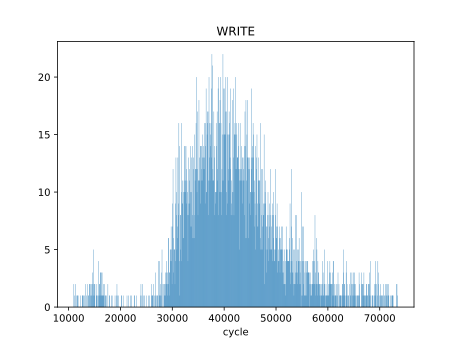

# 基于用户态外部中断的驱动性能分析

## 测试环境

硬件平台：4x Rocket Core @ 100MHz, 2MB L2 Cache, 16MB DRAM
外设：2x AXI UART 16550 @ 6.25M baudrate

## 吞吐率

串口配置为 8 比特字长，无校验位， 1 停止位，理论吞吐率为 625KB/s 。

| 测试场景        | 内核，中断 | 用户，轮询 | 用户，中断 |
| --------------- | ---------- | ---------- | ---------- |
| 裸机，无哈希    | 396        | 542        | 438        |
| 裸机，有哈希    | 123        | 189        | 136        |
| rCore-N，有哈希 | 78         | 410        | 260        |
| rCore-N，有哈希 | 55         | 152        | 123        |

“有哈希”指每次发送或接收时均进行一次 blake3 Hasher::update() 计算，用来模拟计算和 IO 混合负载。表中数据单位为 KB/s 。

可见用户态轮询模式驱动性能最高，在裸机场景下可以接近理论上限；用户态中断性能次之，内核态的中断模式驱动性能最低。

## 驱动延时追踪

read 系统调用：

write 系统调用：

内核态中断：

用户态中断：

