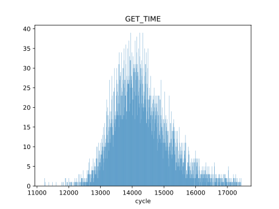

# 基于用户态外部中断的驱动性能分析

## 测试环境

硬件平台：4x Rocket Core @ 100MHz, 2MB L2 Cache, 16MB DRAM
外设：2x AXI UART 16550 @ 6.25M baudrate

## 吞吐率

串口配置为 8 比特字长，无校验位， 1 停止位，理论吞吐率为 625KB/s 。

| 测试场景        | 内核，中断 | 用户，轮询 | 用户，中断 |
| --------------- | ---------- | ---------- | ---------- |
| 裸机，无哈希    | 396        | 542        | 438        |
| 裸机，有哈希    | 123        | 189        | 136        |
| rCore-N，有哈希 | 78         | 410        | 260        |
| rCore-N，有哈希 | 55         | 152        | 123        |

“有哈希”指每次发送或接收时均进行一次 blake3 Hasher::update() 计算，用来模拟计算和 IO 混合负载。表中数据单位为 KB/s 。

可见用户态轮询模式驱动性能最高，在裸机场景下可以接近理论上限；用户态中断性能次之，内核态的中断模式驱动性能最低。

## 驱动延时追踪

read 系统调用：

可见在 14000 和 26000 附近出现了两个峰。

write 系统调用：

耗时集中在 40000 个周期附近。

作为对照，get_time 调用的耗时情况如下：

get_time 的逻辑较为简单，可以认为是一次系统调用的“背景”耗时，集中在 14000 个周期附近。read 调用的一个峰基本与背景延时重合，推测为缓冲区中恰有数据的情况，而 26000 对应的峰推测为缓冲区中无数据而需要等待串口传输的情况。

内核态中断：

一个峰出现在 2500 周期附近且较集中，另一个峰出现在 10000 周期左右，且散布较宽。

用户态中断：

用户态中断驱动一个峰出现在 1800 周期附近，另一个在 4600 附近，整体周期数大幅低于内核态中断驱动，且分布更集中，波动较小。
