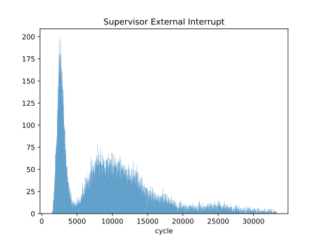

# 用户态中断

---

## 提纲

- 背景
  - RISC-V 特权级和中断架构
  - Linux 内核中断处理
  - 硬件驱动和跨进程通信
- 相关工作
  - Intel x86 用户态中断
  - RISC-V N 扩展
- 系统设计
  - 硬件中断
  - 任务间中断
- 性能评估

---

## 背景

---

### RISC-V 特权模式和中断架构

- RISC-V 指令集有 M、S、U 三种基本的特权模式，以及 H 扩展引入的 HS、VS 模式
- 每个特权模式有各自的中断，低特权中断可以在本特权级或更高特权模式处理，但反之不行

---

### Linux 内核中断处理

硬件中断 —— 上半段 ISR —— 进程唤醒/信号 —— 调度 —— 下半段，路径较长

---

### 硬件驱动和进程间通信

- 驱动通常依赖于中断以及时响应硬件事件并减少 CPU 占用，而只有内核才能使用硬件中断
- 进程间通信 (IPC) 需要同步/通知机制，这种机制通常由内核模拟
- 跨特权和地址空间边界的切换带来大量开销
- 更高效的驱动和 IPC 需要**绕过内核直达用户**的中断机制——用户态中断

---

## 相关工作

---

### Intel x86 用户态中断

- 将中断导入用户空间的任务，上中断源可以是硬件、内核或另一个用户任务
- 在 Sapphire Rapids 系列处理器中支持用户态跨核中断

---

### Intel x86 用户态中断

- 发送的中断会导入内存中的数据结构，且若目标任务正在运行，可立刻处理，不进入内核
- 设计思路可能源于 VT-d 的 Interrupt Posting 扩展，后者允许将中断直接导入虚拟机

---

### RISC-V N 扩展

- 即用户态中断扩展，规定了一些基本的中断控制寄存器和指令
- 与 Intel 思路源于虚拟化不同，N 扩展与 S 态中断规范更类似
- 在 Shakti-C 和赛昉天枢 CPU IP 中有实现

---

## 系统设计

---

### 总览

- 硬件：基于 RISC-V ，实现 N 扩展、扩充 PLIC 、设计新的 UINTC
- 内核：rCore 和 zCore ，实现对多个用户程序中断的管理
- 用户程序：实现基于用户态中断的硬件驱动和 IPC 机制

---

### 中断控制块与缓冲区

- 内核管理用户态中断的数据结构
- 内核与用户任务共享一段内存，用于内核向用户注入中断的内容

---

### 外部中断

- 平台级中断控制器 (PLIC) 规定，每一对 (硬件线程, 特权级) 构成一个上下文
- 将 U 态也计入 PLIC 的上下文，将相应的中断信号连接到 xIP 寄存器
- 在内核中记录每个用户程序占用的中断号，切换任务时控制相应的 PLIC 上下文使能或禁用中断
- 用户态驱动直接访问外设和 PLIC 的地址段处理中断

---

### 外部中断

---

### 任务间中断

- 设计 UINTC 用于控制用户任务间中断
- 在 UINTC 中记录每一对 (发送，接收) 任务的中断等待和使能情况
- 内核为每个申请使用任务间中断的任务分配 UIID ，在任务切换时写入寄存器
- 处理器根据寄存器中的 UIID 值从 UINTC 获取中断信号
- 用户程序直接向 UINTC 写入以发送中断

---

## 性能评估

---

### 测试环境

- CPU: Rocket Core RV64IMACN @ 100MHz x4, 2MB L2 Cache, 2GB DRAM
- 中断控制器: PLIC
- 外设: AXI UART 16550 v2 @ 6.25M baudrate x2
- 系统: rCore-N

---

### 外部中断与用户态驱动

- 吞吐率：串口配置为 8 比特字长，无校验位， 1 停止位，理论吞吐率上限为 625KB/s ，下表数据单位为 KB/s 。

| 测试场景        | 内核，中断 | 用户，轮询 | 用户，中断 |
| --------------- | ---------- | ---------- | ---------- |
| 裸机，无哈希    | 396        | 542        | 438        |
| 裸机，有哈希    | 123        | 189        | 136        |
| rCore-N，无哈希 | 78         | 410        | 260        |
| rCore-N，有哈希 | 55         | 152        | 123        |

“有哈希”指每条数据进行一次 Blake3 哈希计算，用来模拟计算和 IO 混合负载。

---

### 外部中断与用户态驱动

- 系统调用延时
- 切换特权级和地址空间的背景延时很高，约 14000 个周期
- 对串口进行 read 调用，耗时呈现两个峰值，散布较宽

---

### 外部中断与用户态驱动

- 驱动延时
- 内核和用户态中断模式驱动都呈现近似两个峰值
- 用户态驱动延迟的均值和集中程度均好于内核驱动
- 两个驱动的代码逻辑相同，差异可能来自缓存性能

---

## 感谢聆听！
